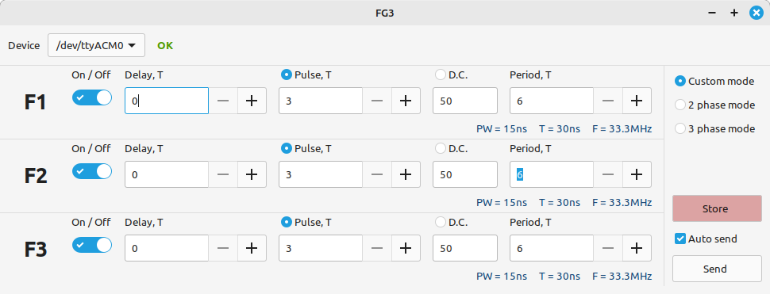

This is GUI application for Linux to control fg3 compatible frequency generators. This is an upgraded version which has unified UART protocol, now it automatically checks for device capabilities, adjusts time units and ranges.

 

Currently compatile devices are 
1. Generator based on avr mcu (Atmega 328) https://github.com/guntars-lemps/fg3avr
2. Generator based on pico2 (RP2350) https://github.com/guntars-lemps/fg3pico

Pico2 based generator has the highset capabilites, max frequency it can generate is 33Mhz with time resolution 10ns. 

For building it requires libgtk dev package, on Ubuntu or Mint Linux it can be installed by the command
```
$ sudo apt install libgtk-3-dev
```

How to build and install
```
$ make
$ sudo make install
```
